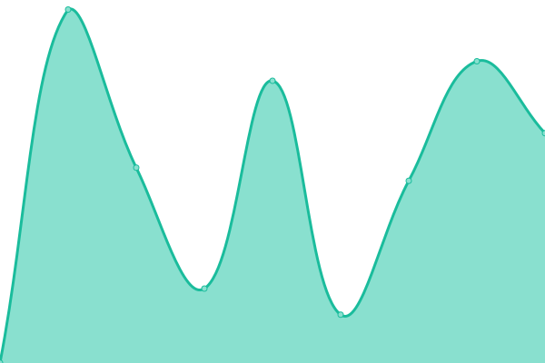

# [📈 Live Status](https://monitor.sayed.page): <!--live status--> **🟩 All systems operational**

This repository contains the open-source uptime monitor and status page for [MD. ABU SAYED](https://abusayed.dev), powered by [Upptime](https://github.com/upptime/upptime).

With [Upptime](https://upptime.js.org), you can get your own unlimited and free uptime monitor and status page, powered entirely by a GitHub repository. We use [Issues](https://github.com/abusayed0206/status/issues) as incident reports, [Actions](https://github.com/abusayed0206/status/actions) as uptime monitors, and [Pages](https://monitor.sayed.page) for the status page.

<!--start: status pages-->
<!-- This summary is generated by Upptime (https://github.com/upptime/upptime) -->
<!-- Do not edit this manually, your changes will be overwritten -->
<!-- prettier-ignore -->
| URL | Status | History | Response Time | Uptime |
| --- | ------ | ------- | ------------- | ------ |
|  [AbuSayed.dev](https://abusayed.dev) | 🟩 Up | [abu-sayed-dev.yml](https://github.com/abusayed0206/status/commits/HEAD/history/abu-sayed-dev.yml) | 

 147ms
     
 | 

<a href="https://monitor.sayed.page/history/abu-sayed-dev">100.00%</a>
    

|  [AbuSayed.dev Blog](https://blog.abusayed.dev) | 🟩 Up | [abu-sayed-dev-blog.yml](https://github.com/abusayed0206/status/commits/HEAD/history/abu-sayed-dev-blog.yml) | 

 416ms
     
 | 

<a href="https://monitor.sayed.page/history/abu-sayed-dev-blog">100.00%</a>
    

|  [Sayed.Page](https://sayed.page/) | 🟩 Up | [sayed-page.yml](https://github.com/abusayed0206/status/commits/HEAD/history/sayed-page.yml) | 

 1155ms
     
 | 

<a href="https://monitor.sayed.page/history/sayed-page">100.00%</a>
    

|  [About Sayed.Page](https://about.sayed.page/) | 🟩 Up | [about-sayed-page.yml](https://github.com/abusayed0206/status/commits/HEAD/history/about-sayed-page.yml) | 

 191ms
     
 | 

<a href="https://monitor.sayed.page/history/about-sayed-page">100.00%</a>
    

<!--end: status pages-->

[**Visit our status website →**](https://monitor.sayed.page)

## 📄 License

- Powered by: [Upptime](https://github.com/upptime/upptime)
- Code: [MIT](./LICENSE) © [MD. ABU SAYED](https://abusayed.dev)
- Data in the `./history` directory: [Open Database License](https://opendatacommons.org/licenses/odbl/1-0/)
