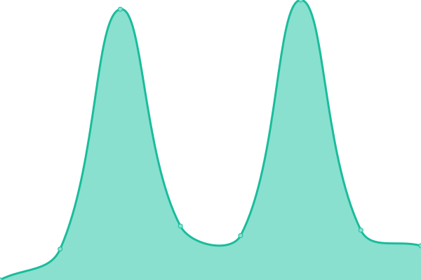

# [📈 Live Status](https://status.sayed.app): <!--live status--> **🟩 All systems operational**

This repository contains the open-source uptime monitor and status page for [MD. ABU SAYED](https://sayed.page), powered by [Upptime](https://github.com/upptime/upptime).

With [Upptime](https://upptime.js.org), you can get your own unlimited and free uptime monitor and status page, powered entirely by a GitHub repository. We use [Issues](https://github.com/abusayed0206/status/issues) as incident reports, [Actions](https://github.com/abusayed0206/status/actions) as uptime monitors, and [Pages](https://status.sayed.app) for the status page.

<!--start: status pages-->
<!-- This summary is generated by Upptime (https://github.com/upptime/upptime) -->
<!-- Do not edit this manually, your changes will be overwritten -->
<!-- prettier-ignore -->
| URL | Status | History | Response Time | Uptime |
| --- | ------ | ------- | ------------- | ------ |
|  [Intro](https://sayed.page) | 🟩 Up | [intro.yml](https://github.com/abusayed0206/status/commits/HEAD/history/intro.yml) | 

 262ms
     
 | 

<a href="https://status.sayed.app/history/intro">100.00%</a>
    

|  [Resume](https://abusayed.dev) | 🟩 Up | [resume.yml](https://github.com/abusayed0206/status/commits/HEAD/history/resume.yml) | 

 221ms
     
 | 

<a href="https://status.sayed.app/history/resume">99.41%</a>
    

|  [Blog](https://sayed.blog) | 🟩 Up | [blog.yml](https://github.com/abusayed0206/status/commits/HEAD/history/blog.yml) | 

 1347ms
     
 | 

<a href="https://status.sayed.app/history/blog">100.00%</a>
    

|  [Projects](https://sayed.app) | 🟩 Up | [projects.yml](https://github.com/abusayed0206/status/commits/HEAD/history/projects.yml) | 

 239ms
     
 | 

<a href="https://status.sayed.app/history/projects">100.00%</a>
    

|  [Laws of Bangladesh](https://laws.sayed.app) | 🟩 Up | [laws-of-bangladesh.yml](https://github.com/abusayed0206/status/commits/HEAD/history/laws-of-bangladesh.yml) | 

 423ms
     
 | 

<a href="https://status.sayed.app/history/laws-of-bangladesh">100.00%</a>
    

|  [CUET Student Directory](https://cuet.sayed.app) | 🟩 Up | [cuet-student-directory.yml](https://github.com/abusayed0206/status/commits/HEAD/history/cuet-student-directory.yml) | 

 436ms
     
 | 

<a href="https://status.sayed.app/history/cuet-student-directory">100.00%</a>
    

|  [Bangla Movies & TV Series](https://movies.sayed.app) | 🟩 Up | [bangla-movies-and-tv-series.yml](https://github.com/abusayed0206/status/commits/HEAD/history/bangla-movies-and-tv-series.yml) | 

 167ms
     
 | 

<a href="https://status.sayed.app/history/bangla-movies-and-tv-series">100.00%</a>
    

|  [Trakt.tv Page](https://trakt.sayed.app) | 🟩 Up | [trakt-tv-page.yml](https://github.com/abusayed0206/status/commits/HEAD/history/trakt-tv-page.yml) | 

 275ms
     
 | 

<a href="https://status.sayed.app/history/trakt-tv-page">100.00%</a>
    

|  [NextShop](https://nextshop.com.bd) | 🟩 Up | [next-shop.yml](https://github.com/abusayed0206/status/commits/HEAD/history/next-shop.yml) | 

 3480ms
     
 | 

<a href="https://status.sayed.app/history/next-shop">100.00%</a>
    

<!--end: status pages-->

[**Visit our status website →**](https://status.sayed.app)

## 📄 License

- Powered by: [Upptime](https://github.com/upptime/upptime)
- Code: [MIT](./LICENSE) © [Anand Chowdhary](https://anandchowdhary.com), supported by [Pabio](https://pabio.com)
- Data in the `./history` directory: [Open Database License](https://opendatacommons.org/licenses/odbl/1-0/)
